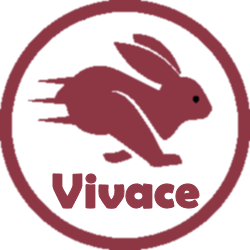

[](https://discord.gg/tPWjMwK) [](https://github.com/tinyBigGAMES/Vivace/stargazers) [](https://github.com/tinyBigGAMES/Vivace/network/members) [](https://github.com/tinyBigGAMES/Vivace/network/members)
[](https://twitter.com/tinyBigGAMES)

## Downloads
<a href="https://github.com/tinyBigGAMES/Vivace/archive/main.zip" target="_blank">**Development**</a> - This build represent the most recent development state an as such may or may not be as stable as the official release versions. If you like living on the bleeding edge, it's updated frequently (often daily) and will contain bug fixes and new features.

<a href="https://github.com/tinyBigGAMES/Vivace/releases" target="_blank">**Releases**</a> - These are the official release versions and deemed to be the most stable.

# Welcome to Vivace
Vivace&trade; (*ve'va'CHe*) Game Toolkit is an SDK to allow easy, fast & fun 2D game development in [Delphi](https://www.embarcadero.com/products/delphi) on desktop PC's running Microsoft Windows® and uses Direct3D® for hardware accelerated rendering.

It's robust, designed for easy, fast & fun use an suitable for making all types of 2D games and other graphic simulations, You access the features from a simple and intuitive API, to allow you to rapidly and efficiently develop your graphics simulations. There is support for bitmaps, audio samples, streaming music, video playback, loading resources directly from a standard ZIP archive and much more.

## Features
- You interact with the toolkit via class objects and a thin OOP framework
- Archive (standard zip, mount/unmount)
- Display ( Direct3D, antialiasing, vsync, viewports, primitives, blending)
- Input (keyboard, mouse and joystick)
- Bitmap (color key transparency, scaling, rotation, flipped, titled)
- Video (ogv format, play, pause, rewind)
- Sprite (pages, groups, animation, polypoint collision)
- Entity (defined from a sprite, position, scale, rotation, collision)
- Actor (list, scene, statemachine)
- Audio (samples, streams)
- Speech (multiple voices, play, pause)
- Font (true type, scale, rotate, 3 builtin)
- Timing (time-based, frame elapsed, frame speed)
- Misc (screenshake, screenshot, starfied, colors, ini based config files, startup dialog, treeview menu)

## Minimum System Requirements
- [Delphi 10](https://www.embarcadero.com/products/delphi) or higher
- Microsoft Windows 10
- DirectX 9

## How to use in Delphi
- Unzip the archive to a desired location.
- Add `installdir\source\library` and `installdir\source\utils`to Delphi's library path so the toolkit source files can be found for any project or for a specific project add to projects search path.
- See examples in the `installdir\examples` for more information about usage. You can load all examples using the project group file located in the `installdir\source` folder.

## Known Issues
- This project is in active development so changes will be frequent 
- Documentation is WIP. They will continue to evolve
- More examples will continually be added

## A Tour of Vivace
### Game Object
You just have to derive a new class from the `TCustomGame` base class and override a few callback methods. You access the toolkit functionality from the classes in the various `Vivace.XXX` units.
```pascal
uses
  Vivace.Color,
  Vivace.Math,
  Vivace.Timer,
  Vivace.Input,
  Vivace.Font,
  Vivace.Font.Builtin,
  Vivace.Game,
  Vivace.Engine,
  uCommon;

const
  cArchiveFilename   = 'Data.arc';

  cDisplayTitle      = 'MyGame';
  cDisplayWidth      = 800;
  cDisplayHeight     = 480;
  cDisplayFullscreen = False;

type
  { TMyGame }
  TMyGame = class(TCustomGame)
  protected
    FFont: TFont;
  public
    procedure OnLoad; override;
    procedure OnExit; override;
    procedure OnStartup; override;
    procedure OnShutdown; override;
    procedure OnUpdate(aDeltaTime: Double); override;
    procedure OnClearDisplay; override;
    procedure OnShowDisplay; override;
    procedure OnRender; override;
    procedure OnRenderHUD; override;
  end;
```
### How to use
A minimal implementation example:
```pascal
uses
  System.SysUtils;

{ TMyGame }
procedure TMyGame.OnLoad;
begin
  // mount archive file
  gEngine.Mount(cArchiveFilename);
end;

procedure TMyGame.OnExit;
begin
  // unmount archive file
  gEngine.Unmount(cArchiveFilename);
end;

procedure TMyGame.OnStartup;
begin
  // open display
  gEngine.Display.Open(cDisplayWidth, cDisplayHeight,  cDisplayFullscreen, cDisplayTitle);

  // create font, use buildin
  FFont := TFont.Create;
end;

procedure TMyGame.OnShutdown;
begin
  // free font
  FreeAndNil(FFont);

  // close display
  gEngine.Display.Close;
end;

procedure TMyGame.OnUpdate(aDeltaTime: Double);
begin
  // process input
  if gEngine.Input.KeyboardPressed(KEY_ESCAPE) then
    gEngine.SetTerminate(True);
end;

procedure TMyGame.OnClearDisplay;
begin
  // clear display
  gEngine.Display.Clear(BLACK);
end;

procedure TMyGame.OnShowDisplay;
begin
  // show display
  gEngine.Display.Show;
end;

procedure TMyGame.OnRender;
begin
end;

procedure TMyGame.OnRenderGUI;
var
  Pos: TVector;
begin
  // assign hud start pos
  Pos.Assign(3, 3, 0);

  // display hud text
  FFont.Print(Pos.X, Pos.Y, Pos.Z, WHITE, alLeft, 'fps %d', [gEngine.FrameRate]);
  FFont.Print(Pos.X, Pos.Y, 0, GREEN, alLeft, 'Esc - Quit', [gEngine.GetFrameRate]);
end;
```
To run your game, call
```pascal
  RunGame(TMyGame);
```
See the examples for more information on usage.

## Support
Website: https://tinybiggames.com  
E-mail : mailto:support@tinybiggames.com  
Discord: https://discord.gg/tPWjMwK  
Twitter: https://twitter.com/tinyBigGAMES
